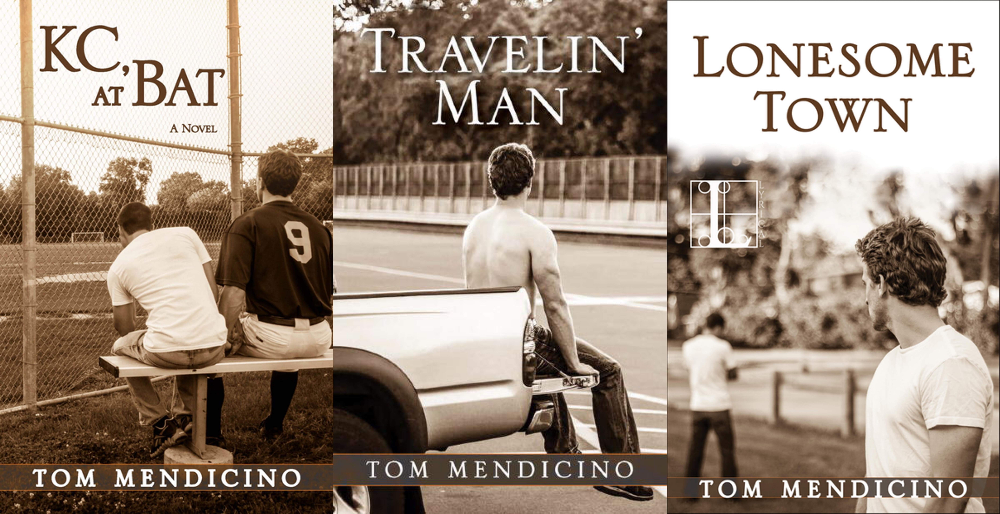

## KC Trilogy
[回到上一页](https://boheme130.github.io/Reviews/)  &nbsp;&nbsp;  [回到主页](https://boheme130.github.io/Fiction.git.io/)

 
 

作品：KC Trilogy 
作者：Tom Mendicino 
评分：4.6/5 

关键词：coming of age, 棒球运动员 & 制作人, 流浪, 22年虐恋

这个系列一共有3本书，每一本都不长，三本加起来比一本普通的小说长度还要短一点，但每一本都短小精悍，构建出了两人那一年的人生阶段缩影。作者和Jim Grimsley文风类似，都喜欢酸甜夹杂的故事，因此两人的爱情分分合合充满曲折，让最终第三次重拾旧情的结局让人觉得更加不易，喜欢angsty类型故事的人绝对不能错过

## KC, at Bat (17岁)

纽约州高中生Charlie被达特茅斯录取，在上大学前的最后一个暑假被父亲派去搬家公司锻炼，枯燥的体力劳动让他几乎决定辞职，然而他却意外发现他暗恋的高中棒球队长KC也在这里打工，更让他惊喜的是，KC主动勾搭上了他，两人见面的第一个周末KC就爬上了Charlie的床。得到男神眷顾的Charlie如履薄冰，生怕阳刚粗犷的对方看不起自己，但其实他不知道KC也遭受着家庭和教练的阴影，两个人的相互救赎给了双方一个难忘的夏日之恋

在结尾，Charlie去上大学，刚刚走出阴影的KC求他保持异地恋。进入常春藤后，Charlie迅速融入了精英艺术小圈子，当KC训练之余横跨大半个美国来找他时，他觉得运动员KC在自己的艺术圈朋友面前非常丢脸，尽管两人之后仍然保持着异地恋，但感情慢慢淡了遂分手

 

## Travelin’ Man （20岁）

上一本里KC透露出了自己悲惨的身世，在和无情的家人断绝关系并告别性侵自己的旧教练后，他独自一人闯天涯，试图进入棒球全国联盟成为专业运动员。Charlie原本是他唯一的精神依靠，但Charlie上常春藤以后慢慢看不起KC两人便分手了，KC的基督徒新教练Freeman对他就像自己的儿子一样，两人产生了深厚如家人般的感情。然而一次事故意外暴露出他的性取向，因此他直接被俱乐部解约前途全毁，签约费也被冻结了，他的车也被毁了。为自己的性取向感到羞耻，不愿意向Freeman求助的KC不告而别，带着身上800美元和一个手提袋独自流浪

流浪过程中，没钱没车成为KC永恒的困境：他为了交通被迫向老男人提供性服务；他因为没钱重新联系了性侵他的前教练乞讨援助；他没钱就医被送入收容所。曾经在赛场上叱咤风云的那个男人死去了，只剩下一副行尸走肉的躯体。万幸的是KC遇到了一个越南老鸨Coleman，Coleman让KC帮忙照顾他的爷爷方便Coleman接客，在Coleman的越南大家庭打杂的日子让KC得以喘息，并第一次感受到了家庭的温暖

长时间的颠沛流离让本不怎么信教的KC皈依基督教。几个月后，KC的基督徒新教练Freeman找到了他，不计前嫌的Freeman不断用基督教义恳求KC重新参赛，并和他一起搬到加州训练。处于人生低谷的KC同意了

 

## Lonesome Town (23岁)

23岁的Charlie毕业后和法学院男友Billy搬到了费城，从事电视节目制作，两人本就性格不合，因此同居后感情岌岌可危。这时Charlie突然在一次活动上重新见到了曾经的夏日初恋KC。此时KC已经走出最低谷，参加了不大不小的一些比赛。两人都没有忘记对方，因此很快旧情复燃

经历众多的KC心态大变，尽管他的性格还是像17岁一样温和，但他的言语间大量夹杂的圣经引言让一直生活在自由派圈子的Charlie又恼火又担心。KC本来有望重新进入全国联盟，但一次意外大受伤再次葬送了他的NHL梦，Freeman再次帮助KC找到新的俱乐部。Charlie拿到一份亚特兰大的新工作，他恳求KC一同前往，但KC的新俱乐部在西海岸。这一次Charlie决定不再轻率放弃，他开始和KC认真远程异地恋，每周末坐着横贯东西的飞机去和KC约会

 

## Teenage Idol (39岁)

<i>这篇后记在Lonesome Town这本书里</i>

23岁的KC和Charlie开启异地恋一段时间后就放弃了，长途的跋涉和Freeman的宗教信仰不允许两人有过多亲密的机会，两人约定好继续当朋友，但几年后也慢慢没了联系。Charlie在39岁时母亲去世了，在家乡葬礼上他重新见到了KC. 多年来两人都经历了很多，Charlie在电视行业工作，和多个男友分分合合但都没有结果；KC辗转各个联盟但一直没有大成绩，他的教练Freeman去世后他回到了家乡并摒弃了基督教，用曾经签约的钱投资，反而成为了当地小有成就的快餐连锁老板。

现在即将步入40的两人终于有了稳定且靠近的工作和居所，就这样在22年后，两人终于重新拾起了曾经的夏日恋情